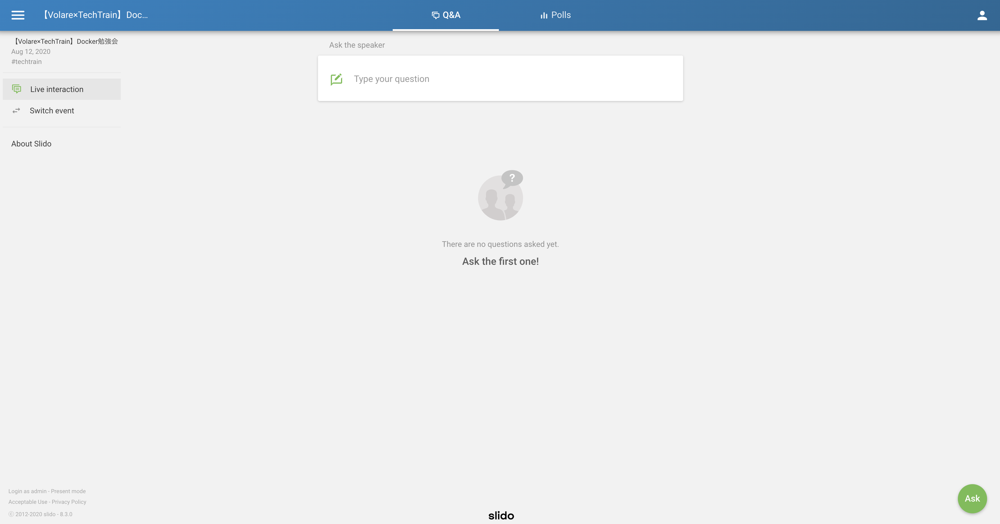
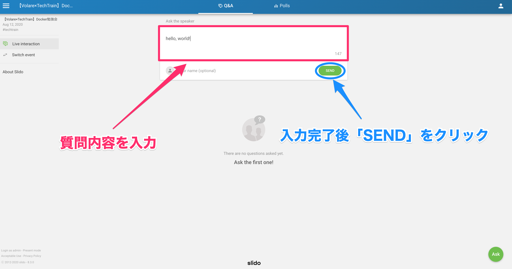
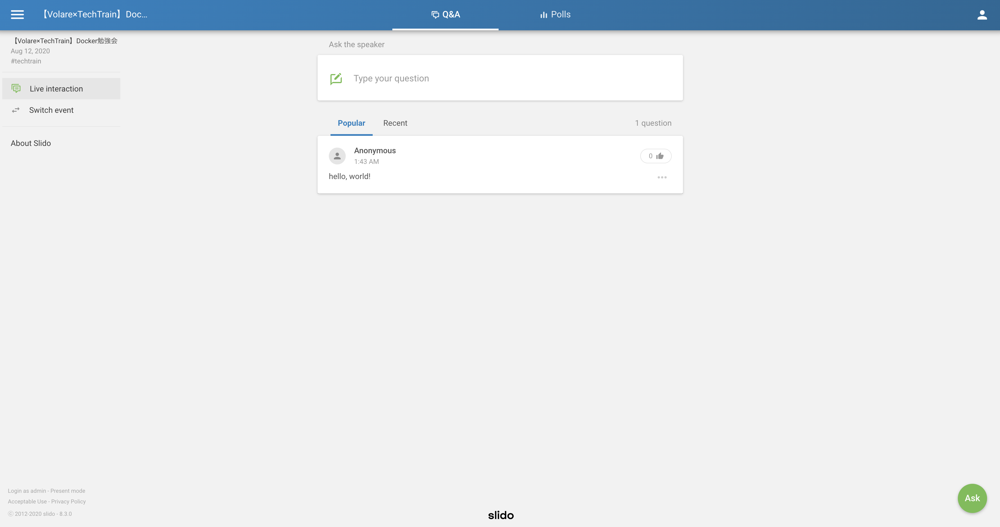
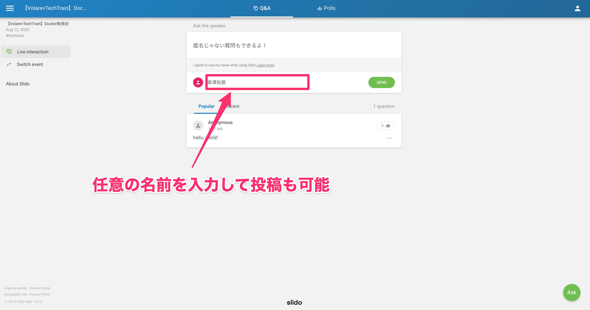
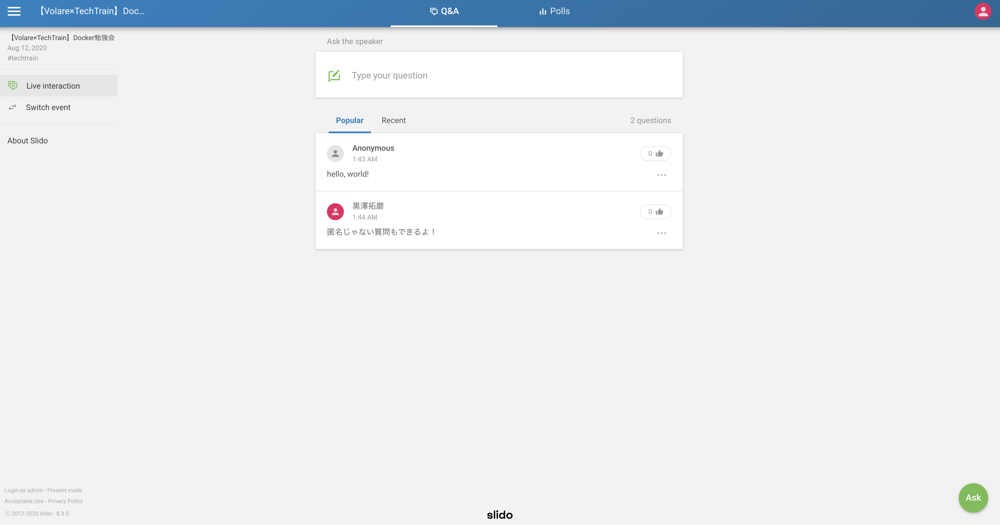

# 【Volare × TechTrain】Docker勉強会
## セットアップ
``` sh
git clone git@github.com:Takumaron/DockerHandsOn.git

cd DockerHandsOn
```

## 勉強会資料
https://www.canva.com/design/DAED6dNQnj0/dtsCXpG-yqhdZT_sRvrsTw/view

## slidoについて
1. https://www.sli.do/ にアクセス！
2.  `Enter event code` に「techtrain」と入力→Enter

下記のような画面が開けばOK！


### 匿名での質問




### 任意のユーザとして質問




### いいねが多い質問が上位に表示されます！
自分も聞きたい！と思った質問があったら積極的にいいねを押しましょう。

